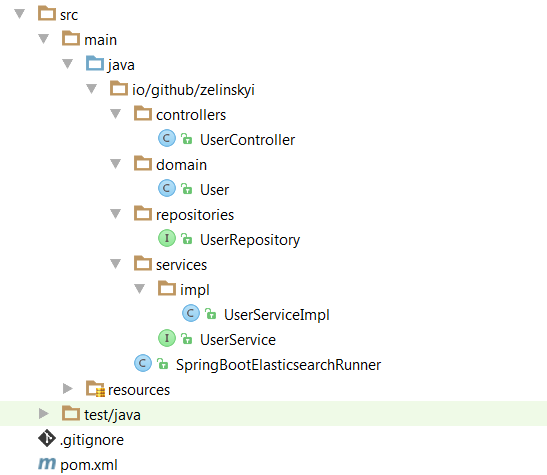

# Elastic and Spring Boot sample

### Table of contents
***

* **[Hello "user" example](./README.md#hello-user-example)**
  * [Some short info from Wikipedia](./README.md#some-short-info-from-wikipedia)
  * [Prerequisites](./README.md#prerequisites)
  * [Lets move to the example](./README.md#lets-move-to-the-example)
* [Behind the scene of hello "user"](https://www.google.com)
 


### Hello user example
***

#### Some short info from Wikipedia:

 1. **Elasticsearch** - is a search server based on Lucene.
 2. **Spring Boot** - is Spring's convention-over-configuration solution for creating stand-alone, production-grade Spring based Applications that you can "just run".


#### Prerequisites:

1. Installed Java IDE (In my case I will use IntelliJ IDEA‎).
2. Installed Maven and synchronized with your IDE.


#### Lets move to the example:


##### Maven dependencies setup:

---

* Create maven project in your IDE.
* Add Spring Boot dependencies into pom.xml (check the source code for that also [pom.xml](./pom.xml#L10-22)):
(We will add Spring Boot parent into dependency management section)

* Also we need to add several dependencies (check the source code for that also [pom.xml](./pom.xml#L22-55)):
  
  * **_spring-boot-starter-web_** - we need this to create simple RESTful web service 
  * **_spring-boot-starter-data-elasticsearch_** - we need this to work easily with Elasticsearch   
  * **_lombok_** - useful tool library to simplify creating POJO 
  * **_spring-boot-starter-test_** - set of testing tool libraries
  * **_json-path-assert_** - helping library for unit tests


##### Creating entity, controller, service:

---

* First of all we need simple plain java object as DTO (in our case it will be User).
  * We will implements this class with help of Lombok library.
  * Follow the source code: [User.java](./src/main/java/io/github/zelinskyi/domain/User.java)

* Lets create controller:
  * Check the source code of controller: [UserController.java](./src/main/java/io/github/zelinskyi/controllers/UserController.java)
  * This is simple Spring Rest controller with two methods.

* Also we need to implement service layer:
  * Check the source code of two classes:
    * [UserService.java](./src/main/java/io/github/zelinskyi/services/UserService.java)
    * [UserServiceImpl.java](./src/main/java/io/github/zelinskyi/services/impl/UserServiceImpl.java)
    

##### Creating repository:

---

* So for now lets move to Elasticsearch part. We need to implement a simple repository.
  Please, check the source code: [UserRepository.java](./src/main/java/io/github/zelinskyi/repositories/UserRepository.java)
  You can see:
  
```java
public interface UserRepository extends ElasticsearchCrudRepository<User, Long> {}
```

* Extending **ElasticsearchCrudRepository** we get basic CRUD functionality to work with Elasticsearch as data source.

So, now we have ready application for running.

Check you project tree structure it should be like in repo:




##### Run and check implementation:

---

Lets run application and check it:

* To run it just run the class **SpringBootElasticsearchRunner**

Now we can check our creation and searching user by invoking url with payload:

* To check creation of user invoke this url with next JSON payload using POST HTTP method: 

```
127.0.0.1:8080/user
```


```json
{
  "id": 1,
  "firstName": "John",
  "lastName": "Smith"
}
```

* To check the searching of user just invoke the url using GET HTTP method:

```
127.0.0.1:8080/user/1
```

You should see the answer like: 

```json
{
  "id": 1,
  "firstName": "John",
  "lastName": "Smith"
}
```